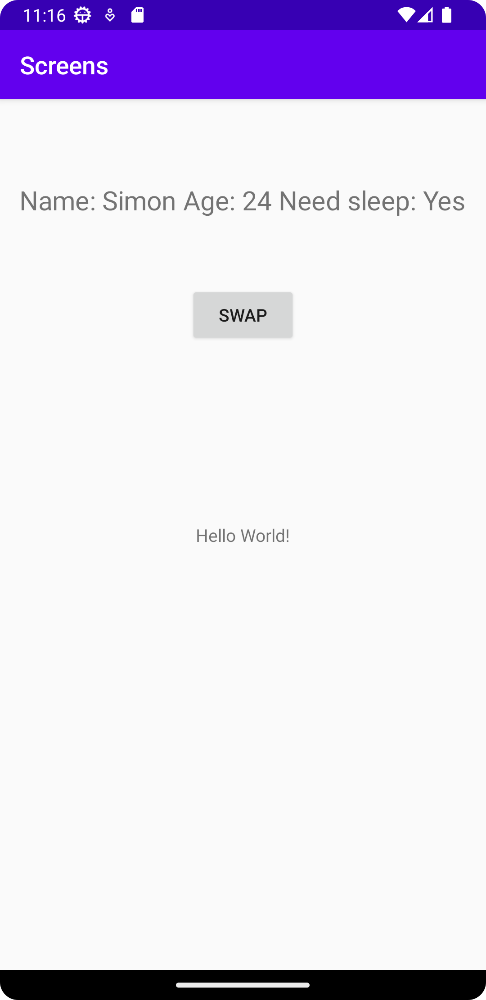

# Rapport

Skapade en ny activity och en knapp som startar den genom ett onclick event. Lade till data i intent bundeln genom att använda extras. Lade sedan till den datan som en textview i den andra activityn.


```     
     
     <application
        android:allowBackup="true"
        android:icon="@mipmap/ic_launcher"
        android:label="@string/app_name"
        android:roundIcon="@mipmap/ic_launcher_round"
        android:supportsRtl="true"
        android:theme="@style/AppTheme">
        <activity android:name=".MainActivity">
            <intent-filter>
                <action android:name="android.intent.action.MAIN" />

                <category android:name="android.intent.category.LAUNCHER" />
            </intent-filter>

        </activity>
        <activity android:name=".SecondActivity">

        </activity>
    </application>
  
_________________________________________________________________________________  
  
  private Button button;

    @Override
    protected void onCreate(Bundle savedInstanceState) {
        super.onCreate(savedInstanceState);
        setContentView(R.layout.activity_main);


        button = findViewById(R.id.SwapActivity);
        button.setOnClickListener(MainActivity.this);

    }


    @Override
    public void onClick(View view) {
    Intent intent = new Intent(MainActivity.this, SecondActivity.class);
    intent.putExtra("Who","Simon");
    intent.putExtra("Age",24);
    intent.putExtra("Need sleep?", "Yes");
    startActivity(intent);


    }
    
________________________________________________________________________________
    
    public class SecondActivity extends AppCompatActivity {

    private TextView text;

    @Override
    protected void onCreate(Bundle savedInstanceState) {
        super.onCreate(savedInstanceState);
        setContentView(R.layout.activity_main);

        text = findViewById(R.id.textViewInfo);

        Bundle extras = getIntent().getExtras();
        if (extras != null){
            String name = extras.getString("Who");
            int number = extras.getInt("Age");
            String sleep = extras.getString("Need sleep?");

            text.setText("Name: " + name + " Age: " + number + " Need sleep: " + sleep);

        }


    }
}

_____________________________________________________________________

    <Button
        android:id="@+id/SwapActivity"
        android:layout_width="wrap_content"
        android:layout_height="wrap_content"
        android:layout_marginStart="162dp"
        android:layout_marginLeft="162dp"
        android:layout_marginTop="157dp"
        android:layout_marginEnd="162dp"
        android:layout_marginRight="162dp"
        android:layout_marginBottom="151dp"
        android:text="Swap"
        app:layout_constraintBottom_toTopOf="@+id/textView"
        app:layout_constraintEnd_toEndOf="parent"
        app:layout_constraintStart_toStartOf="parent"
        app:layout_constraintTop_toTopOf="parent" />

    <TextView
        android:id="@+id/textViewInfo"
        android:layout_width="wrap_content"
        android:layout_height="wrap_content"
        android:layout_marginStart="176dp"
        android:layout_marginLeft="176dp"
        android:layout_marginTop="75dp"
        android:layout_marginEnd="177dp"
        android:layout_marginRight="177dp"
        android:layout_marginBottom="62dp"
        android:scaleX="1.5"
        android:scaleY="1.5"
        android:text="TextView"
        app:layout_constraintBottom_toTopOf="@+id/SwapActivity"
        app:layout_constraintEnd_toEndOf="parent"
        app:layout_constraintStart_toStartOf="parent"
        app:layout_constraintTop_toTopOf="parent" />
        
        
```



